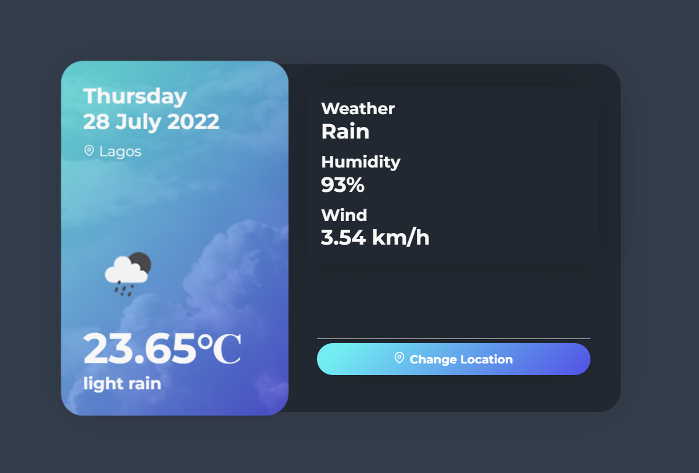

# weather-app

***

[View Live](https://silver-weather-app.onrender.com/)

## Overview

*A simple weather app that uses the openweather api to get current weather data.*

***

## Features

This project includes:

- [x] Landing page
- [x] Server
- [x] Input field
- [x] Weather data

***

## How to instal

1. Clone the repo locally
2. run `npm install`
3. run `node app.js`
4. *server should be running on port 5050* you can change it if you like in the app.js file
5. If you don't have node installed check [Node official website](https://nodejs.org/en/) to download 
6. Repeat steps 2 through 4

***

## Want to contribute?

*Feel free to create an issue.*

### License

MIT License

(c) Lordson Silver
